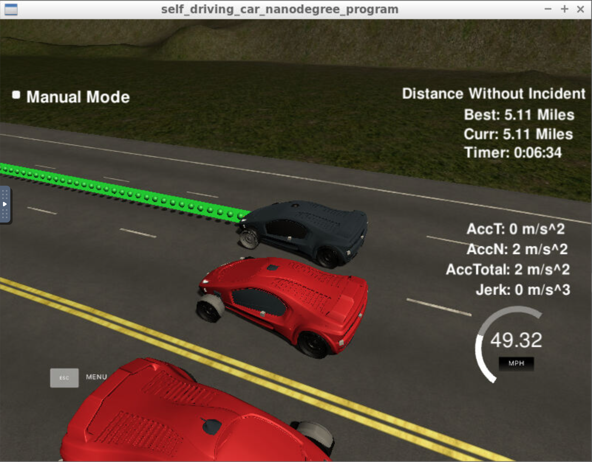

# CarND-Path-Planning-Project
Self-Driving Car Engineer Nanodegree Program

   
# Overview

In this project, we need to implement a path planning algorithms to create smooth, safe paths for the car to follow along a 3 lane highway with traffic on a simulator provided by Udacity([the simulator could be downloaded here](https://github.com/udacity/self-driving-car-sim/releases/tag/T3_v1.2)). The simulator sends car localization information (car's position and velocity) and sensor fusion information about the rest of the cars in the highway (Ex. car id, velocity, position). It expects a set of points spaced in time at 0.02 seconds representing the car's trajectory. The communication between the simulator and the path planner is done using [WebSocket](https://en.wikipedia.org/wiki/WebSocket). The path planner uses the [uWebSockets](https://github.com/uNetworking/uWebSockets) WebSocket implementation to handle this communication. Udacity provides a seed project to start from on this project ([here](https://github.com/udacity/CarND-Path-Planning-Project)).

# Rubic points

## Compilation

### The code compiles correctly.
A new spline header file was added and all other changes are within src/main.cpp

## Valid trajectories

### The car is able to drive at least 4.32 miles without incident.
The result screenshot can be seen at the beginning of this README file.

### The car drives according to the speed limit.
No speed limit red message.

### Max Acceleration and Jerk are not Exceeded.
No Max jerk red message.

### Car does not have collisions.
No collisions.

### The car stays in its lane, except for the time between changing lanes.
Done.

### The car is able to change lanes
The car will change the lane if another car before is too slow, then it will check if there are other vehicles within [-30m, 30m] range of ego vehicle, if the lane is free the ego car will change the lane, otherwise it will reduce the speed.

## Reflection

At the beginning, with the localization and sensor fusion data, it intents to yield the reference speed and lane, the main logic is as follows:

- If there is a car in front of us on ego lane within the threshold, we will reduce the speed and try to change the lane.
- If cars on our left are not with in the safty distance threshold, we will be able to change the lane to left if it requests to change the lane.
- If cars on our right are not with in the safty distance threshold, we will be able to change the lane to right if it requests to change the lane and not possible to change to left side.
- If both left and right lane change are not possible, we will reduce the speed and keep in current lane.

Given the reference speed and target lane, the next part does the calculation of the trajectory.

First, the last two points of the previous trajectory are used in conjunction three points at a far distance to initialize the spline calculation. To make the work less complicated to the spline calculation based on those points, the coordinates are transformed to local car coordinates.

In order to ensure more continuity on the trajectory (in addition to adding the last two point of the pass trajectory to the spline adjustment), the pass trajectory points are copied to the new trajectory. The rest of the points are calculated by evaluating the spline and transforming the output coordinates to not local coordinates.